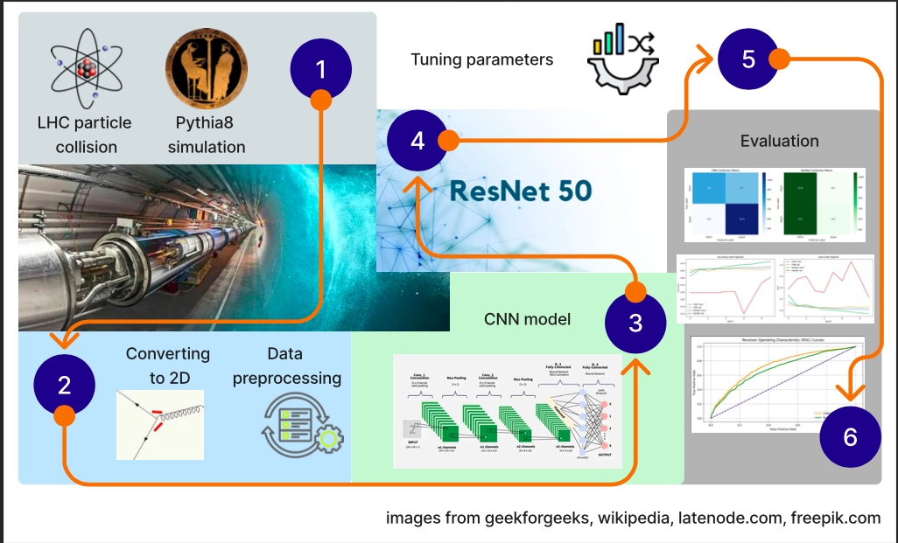
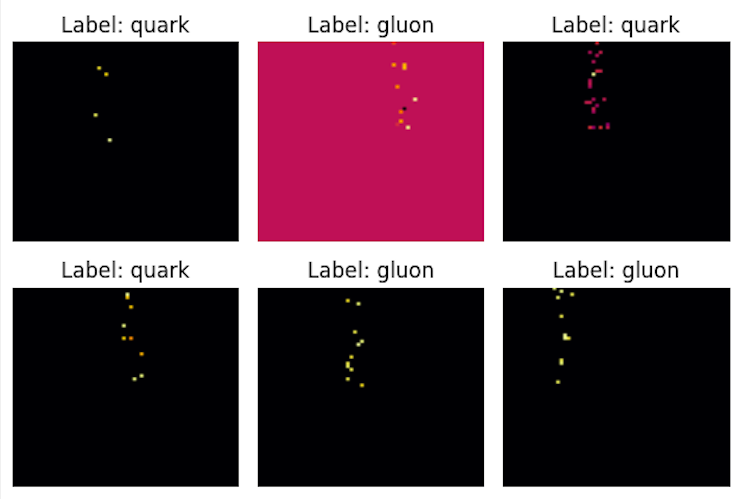
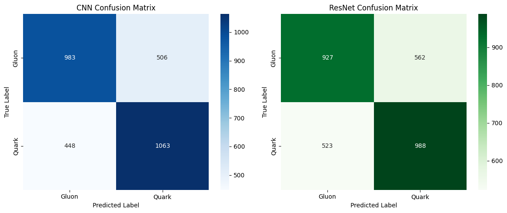
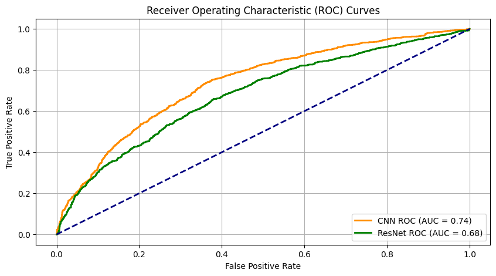
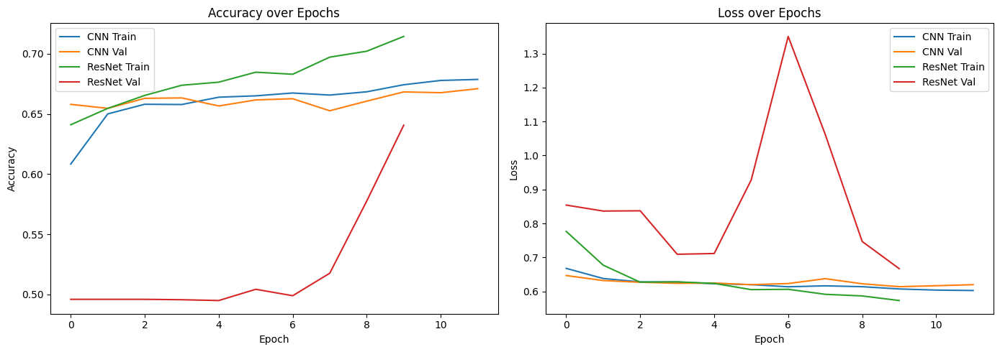

# Exploring the use of regular and ResNet CNNs in Quark and Gluon Jet Classification

### Introduction
This project explores the classification of Quark and Gluon jets in high-energy particle collision events. Specifically, a custom Convolutional Neural Network (CNN) and a pre-trained ResNet50 are used for classifying quark and gluon jets, using 2D histogram representations derived from Pythia8 simulations. Pythia8 is an event generator that uses random samples based on real physics to simulate what happens in a real collider.
  The goal was to evaluate the performance of these models in a binary classification task using only visual features, without incorporating high-level physical attributes like jet substructures. The dataset consists of 40,000 samples (20,000 quark and 20,000 gluon jets), transformed into normalized 64×64 grayscale histograms. The CNN was carefully tuned for optimal architecture and regularization, while the ResNet50 was applied with matching parameters to allow fair comparison. Performance was evaluated using precision, recall, F1-score, and ROC-AUC metrics. Results showed that both models achieved moderate classification performance, with the CNN slightly outperforming ResNet50. The best CNN configuration reached an accuracy of 68.2% and an AUC of 0.74, surpassing random guessing but falling short of deployment-ready reliability.

The link to the dataset can be found here: https://zenodo.org/records/3164691/files/QG_jets.npz
(_reference: P. T. Komiske, E. M. Metodiev, J. Thaler, Energy Flow Networks: Deep Sets for Particle Jets, JHEP 01 (2019) 121, arXiv:1810.05165._)

### Workflow
  

### Image showing the 2D histograms with labelling quark or gluon (with added colours through heatmap)
  
Quark jets tend to be narrower and have fewer particles while gluon jets are wider, more diffuse, and contain more particles. Human eyes struggle to spot difference.

### Results and visualisation

The results of the simple CNN and the ResNet are very similar, although the CNN slightly outperforms the ResNet. In the confusion matrix, we see that both models are slightly biased towards 1 (gluons) 4. The CNN achieved a higher overall validation accuracy and AUC score 5.

The CNN curve is yellow and the ResNet curve is Green. The dotted blue line
represents the baseline, which is equal to random guessing.

When it comes to loss and accuracy over epochs, the simple CNN performed much better than the ResNet. The ResNet is too deep for this dataset, and was overfitting. This can be seen in the figure for accuracy and loss over epochs - where the line representing the ResNet validation is very random and far from the other lines, while the ResNet train-line is the best performing 3. We can also tell from this figure that the improvement over epochs is not very big for the CNN validation and the model is not learning very well.

A full report has been written on the topic including experimental settings, in-depth analysis of the results and future directions of the study. It can be found here: https://www.overleaf.com/read/mwbcwzqttqwd#37cc23
